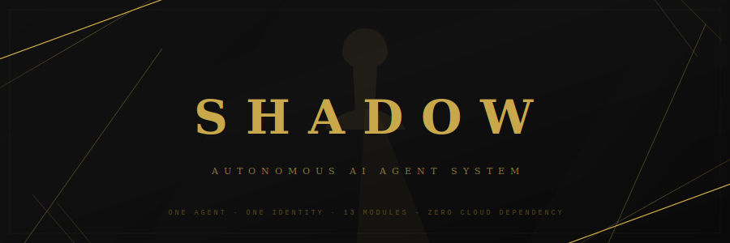

<p align="center">
  
</p>

<p align="center">
  
  
  
  
  
  
</p>

<p align="center">
  <b>Locally-hosted, privacy-first personal AI agent.</b><br/>
  <sub>Not a chatbot. Not a wrapper. A fully autonomous agent with memory, ethics, security, and 13 specialized modules — running on your hardware with zero recurring API costs.</sub>
</p>

---

## Architecture

Shadow is an **agent**, not a chatbot. Every interaction flows through a seven-step decision loop:

```
┌─────────┐    ┌──────────┐    ┌─────────────┐    ┌──────┐    ┌─────────┐    ┌──────────┐    ┌─────┐
│ RECEIVE  │───▶│ CLASSIFY │───▶│LOAD CONTEXT │───▶│ PLAN │───▶│ EXECUTE │───▶│ EVALUATE │───▶│ LOG │
└─────────┘    └──────────┘    └─────────────┘    └──────┘    └─────────┘    └──────────┘    └─────┘
                    │                                              │
                    ▼                                              ▼
               ┌──────────┐                                 ┌──────────┐
               │ CERBERUS │  ◀── safety gate ──────────────▶│ CERBERUS │
               └──────────┘                                 └──────────┘
```

Every tool call goes through [MCP](https://modelcontextprotocol.io/) (Model Context Protocol) — the brain is replaceable, the hands stay the same.

## Modules

| | Module | Role | Tools |
|---|--------|------|:-----:|
| 🎯 | **Shadow** | Master orchestrator, task tracking, system health | 4 |
| ⚡ | **Wraith** | Fast brain — handles 80% of daily tasks, reminders, routing | 12 |
| 🛡️ | **Cerberus** | Ethics gate, safety approvals, injection detection, plus the absorbed security surface (firewall, network scanning, file integrity, threat intel — Phase A merge) | 39 |
| 🌐 | **Apex** | Claude/GPT API fallback with cost tracking & escalation learning | 7 |
| 📚 | **Grimoire** | Three-layer memory — SQLite + ChromaDB vector store | 6 |
| 📡 | **Harbinger** | Morning/evening briefings, alerts, Telegram notifications | 12 |
| 🔍 | **Reaper** | Web research, scraping, Reddit, YouTube transcript analysis | 5 |
| 💻 | **Omen** | Code execution sandbox, linting, review, git ops, model eval, plus math/logic/unit/finance/stats (absorbed Cipher in Phase A) | 47 |
| ✍️ | **Nova** | Content creation, document generation, templates | 6 |
| | **Total (9 active modules)** | | **119** |

> Phase A consolidation also moved Void to a daemon (`daemons/void/`)
> for 24/7 monitoring outside the registry, absorbed Cipher into Omen
> as a utility sub-namespace, and made Morpheus
> (creative-discovery pipeline) opt-in via `config.morpheus.enabled`
> — all three intentionally absent (or absorbed) in the
> active module table above.

> All modules communicate via a multi-agent backbone: MessageBus, EventSystem (20 event types), priority queue with preemption, and shared read-only Grimoire access.

## Tech Stack

```
Runtime         Python 3.14+ · Ollama · llama.cpp
AI Models       Gemma 4 26B (primary) · nomic-embed-text (embeddings)
Database        SQLite (WAL mode) + ChromaDB (768d vectors)
Orchestration   LangGraph · MCP (tools) · A2A (agent comms)
Search          SearXNG · DuckDuckGo · Bing · Reddit .json
Security        Cerberus (ethics gate · security surface · injection detection)
Notifications   Telegram Bot · Discord Bot · severity-gated alerting
Observability   Langfuse (self-hosted) · structured logging
Fallback APIs   Anthropic Claude · OpenAI GPT (cost-tracked)
Frontend        React + Tailwind · Electron desktop · PWA mobile
```

## Project Structure

```
Shadow/
├── modules/                  # 9 active modules (post-Phase-A)
│   ├── shadow/               # Orchestrator, task tracker, growth engine
│   ├── wraith/               # Fast brain, temporal tracking
│   ├── cerberus/             # Safety gate + injection detector + absorbed
│   │   └── security/         #   security surface (Sentinel, Phase A)
│   ├── apex/                 # API fallback, escalation logging
│   ├── grimoire/             # Memory (SQLite + ChromaDB)
│   ├── harbinger/            # Briefings, alerts, notifications
│   ├── reaper/               # Web research, scraping
│   ├── omen/                 # Code tools, sandbox, model eval +
│   │                         #   absorbed math/logic/finance/stats (Cipher, Phase A)
│   ├── nova/                 # Content creation
│   └── morpheus/             # Discovery pipeline (opt-in, dormant by default)
├── daemons/
│   └── void/                 # 24/7 monitoring (demoted from module, Phase A)
├── tests/                    # 1,422 tests
├── config/                   # Configuration & environment
├── data/                     # Runtime data (DBs, vectors, logs)
├── scripts/                  # Utility scripts
├── services/searxng/         # Self-hosted search engine config
├── identity/                 # System prompts & personality
└── main.py                   # CLI entry point
```

## Running Tests

```bash
# Full suite
python -m pytest tests/ -v

# Single module
python -m pytest tests/test_cerberus.py -v

# Skip slow import tests
python -m pytest tests/ -v -m "not slow"
```

## Design Principles

- **Privacy is non-negotiable.** All data stays local. No telemetry. No cloud dependency for core function.
- **One identity.** Modules are task-specific configurations, not separate personalities. Shadow has one voice.
- **Ethics from the ground up.** Every model is abliterated before use. Values come from the owner's framework, not the manufacturer.
- **Agent, not assistant.** Shadow acts autonomously within defined safety boundaries — Cerberus gates every action.
- **Model-agnostic.** Swap the brain without rewiring the hands. MCP makes every tool work with every model.

## Requirements

- Python 3.14+
- [Ollama](https://ollama.ai) (local LLM runtime)
- 32GB+ RAM recommended
- NVIDIA GPU with 16GB+ VRAM (RTX 3090/4090/5090)

---

<p align="center">
  <sub>Built in the dark. Runs in the shadows.</sub>
</p>
